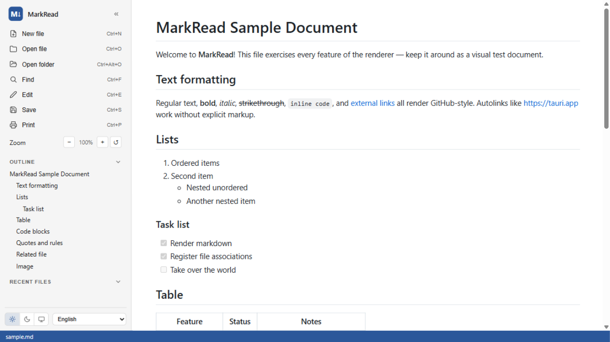
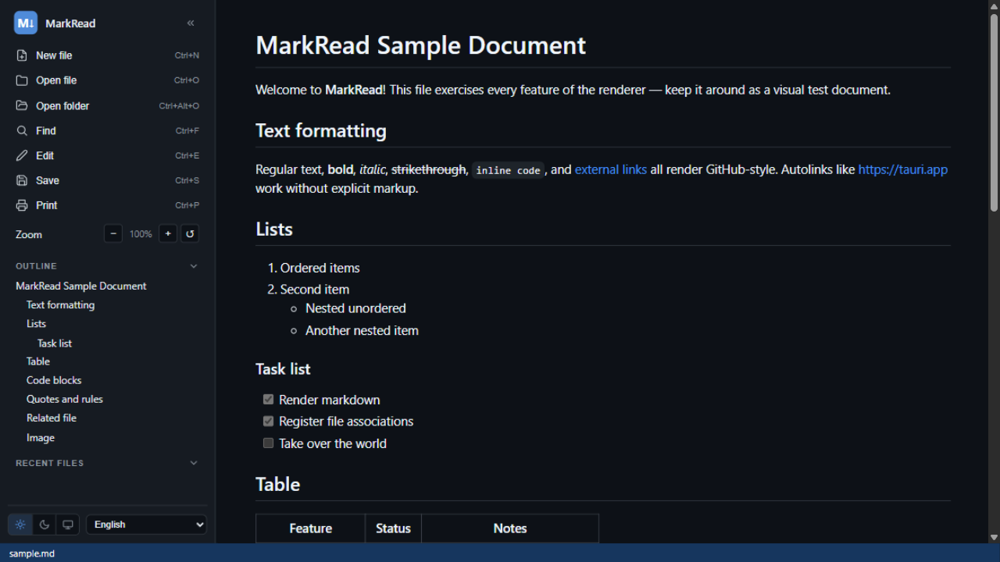
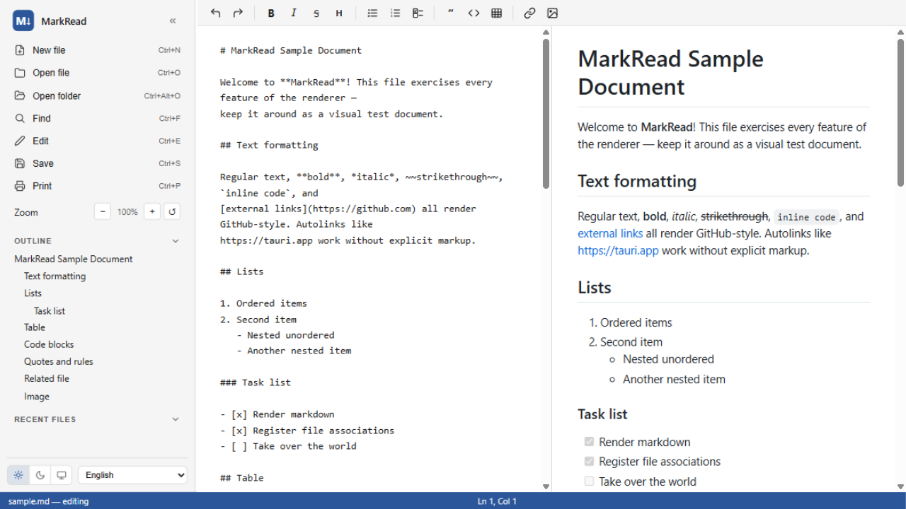
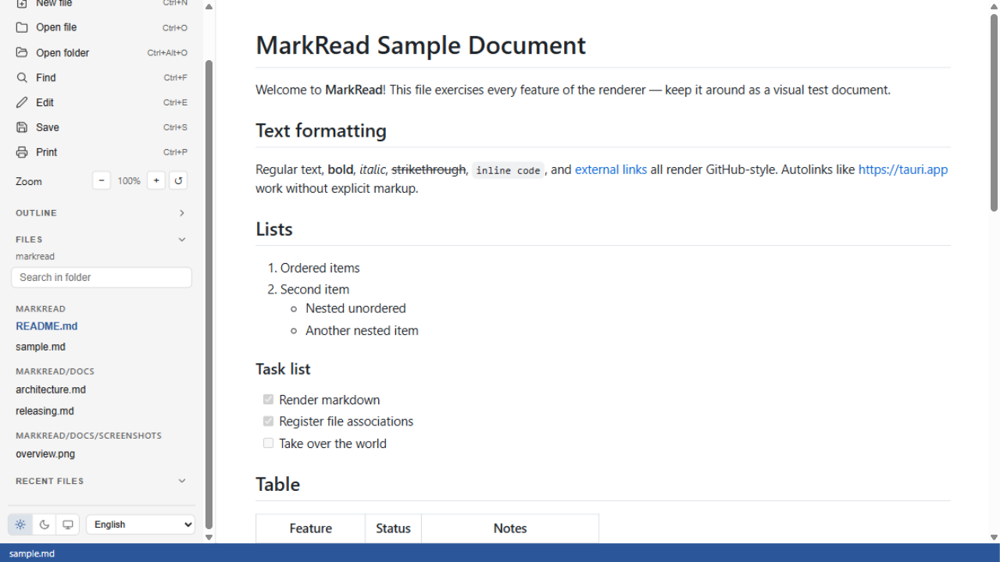
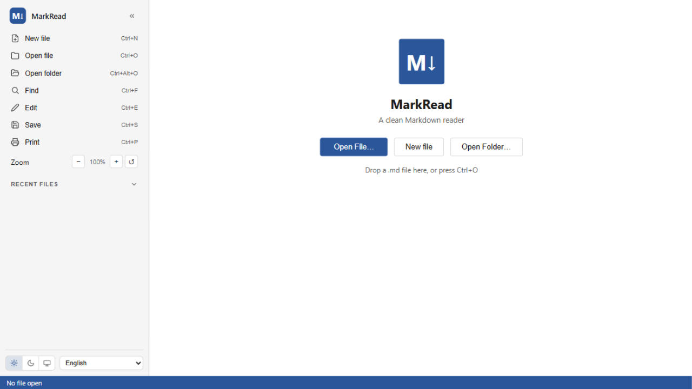

# MarkRead

A clean, fast Markdown reader and editor for **Linux**, **macOS** and
**Windows**, built with [Tauri v2](https://v2.tauri.app).


[](LICENSE)

MarkRead registers itself as a viewer for `.md` / `.markdown` / `.mdown` / `.mkd`
files on install — double-click any Markdown file in your file manager and it
opens straight in MarkRead.



## Screenshots

| Reading (dark)                                              | Editing with live preview                                        |
| ----------------------------------------------------------- | ---------------------------------------------------------------- |
|       |  |

| Folder mode (search across files)                            | Welcome / navigation                                             |
| ------------------------------------------------------------ | ---------------------------------------------------------------- |
|               |                   |

## Features

### Reading

- **GitHub-style rendering** — tables, task lists, strikethrough, anchors,
  typographic punctuation, syntax highlighting (highlight.js)
- **Mermaid diagrams and KaTeX math**, lazily loaded only when the document
  uses them
- **Outline sidebar** with scroll-spy navigation and collapsible groups
- **Resume where you stopped** — the reading position is saved per file and
  restored on reopen, with a reading-progress bar
- **Auto-reload** — the file is watched on disk; external edits re-render the
  document while keeping your position (the editor buffer is never clobbered)
- **Print / export PDF** (`Ctrl/Cmd + P`) with a dedicated print stylesheet
- **Find in page** (`Ctrl/Cmd + F`) with match highlighting
- **Zoom** (`Ctrl/Cmd + +/-/0`), persisted
- **Drag & drop** a file (or a whole folder) onto the window
- **Recent files** group in the sidebar
- **Links**: external links open in your browser, links to other `.md` files
  open in-app; **copy button** on code blocks; back-to-top button
- **Local images** with relative paths resolve against the document's folder

### Editing (`Ctrl/Cmd + E`)

- **Split editor with live preview** — source on the left, rendered document
  on the right, scrolling in sync
- **Formatting toolbar**: bold, italic, strikethrough, heading cycle, bullet /
  numbered / task lists, blockquote, code, table template, link, image,
  undo/redo — preserving the native undo stack
- Word-style **Ln / Col** indicator in the status bar
- CRLF-preserving saves (Windows files stay byte-faithful)
- **New file** (`Ctrl/Cmd + N`): creates and opens a Markdown file straight
  into the editor, defaulting to the open workspace

### Workspace

- **Folder mode** — open a folder and browse its Markdown files in the
  sidebar, grouped by subfolder, with **full-text search across files**
  (match snippets with line numbers)
- **ZCode-style sidebar**: quick actions with shortcut hints, resizable by
  dragging (double-click to reset), collapsible groups, theme switcher and
  language selector in the footer
- **Check for updates** against GitHub releases, with an optional
  check-on-startup

### General

- **Light / dark / follow-system theme**
- **UI in English, Português (Brasil) or Español** — auto-detected, switchable
  in the sidebar footer
- Sanitized rendering (DOMPurify) — embedded scripts never run; Mermaid runs
  with `securityLevel: strict`
- Single instance: opening another file focuses the existing window

## Install

Grab the installer for your platform from
[Releases](../../releases):

| Platform    | File                        | Registers file associations? |
| ----------- | --------------------------- | ---------------------------- |
| Linux       | `.deb`                      | ✅ Yes (recommended)          |
| Linux       | `.rpm`                      | ✅ Yes                        |
| Linux       | `.AppImage`                 | ❌ No (AppImage limitation)   |
| macOS       | `.dmg`                      | ✅ Yes                        |
| Windows     | `.exe` (NSIS)               | ✅ Yes                        |

> **Linux**: MarkRead runs natively on Linux (WebKitGTK). The `.deb` and
> `.rpm` packages ship a desktop entry, so Markdown files open with MarkRead
> straight from Nautilus/Dolphin/Files, and printing uses the standard GTK
> print dialog (which can export PDF). The auto-reload file watcher uses
> inotify — no extra setup needed.

After installing, use your file manager's **Open With → MarkRead** to make it
the default viewer for Markdown files.

## Development

### Prerequisites

- [Node.js](https://nodejs.org) 20+
- [Rust](https://rustup.rs) (stable)
- Linux only — system packages:

  ```bash
  # Debian / Ubuntu / Pop!_OS
  sudo apt install libwebkit2gtk-4.1-dev libgtk-3-dev libayatana-appindicator3-dev librsvg2-dev libdbus-1-dev

  # Fedora
  sudo dnf install webkit2gtk4.1-devel gtk3-devel libappindicator-gtk3-devel librsvg2-devel dbus-devel
  ```

### Run

```bash
npm install
npm run tauri:dev
```

Without a Tauri backend, `npm run dev` serves the UI in a plain browser tab
(features that need the OS — dialogs, file watching, printing — are stubbed).

### Build installers

```bash
npm run tauri:build
```

Outputs per platform (in `src-tauri/target/release/bundle/`):

- Linux: `deb/`, `rpm/`, `appimage/`
- macOS: `dmg/`
- Windows: `nsis/`, `msi/`

Cross-compiling is not supported — build on each OS, or push a tag and let
[GitHub Actions](.github/workflows/build.yml) build all three platforms.

### Test document

`sample.md` at the repository root exercises every renderer feature; open it
with the app to eyeball regressions.

## File associations — how it works

- **Windows**: the NSIS installer writes registry entries mapping the
  extensions to MarkRead (`Open With` list gets a MarkRead entry).
- **macOS**: `CFBundleDocumentTypes` in the app bundle's `Info.plist` makes
  `.md` files openable with MarkRead.
- **Linux**: the `.deb`/`.rpm` packages ship a desktop entry with
  `MimeType=text/markdown;...`, so `Open With` and default-application pickers
  list it.
- When a file is opened, its path reaches the app via CLI argv
  (Windows/Linux), the macOS `open-file` event, or the single-instance plugin
  (app already running) — and the UI renders it.

## License

[MIT](LICENSE)
